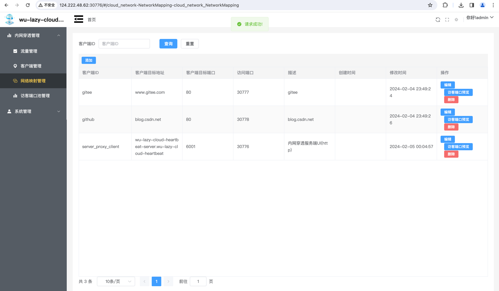

    
    
    
    
    
     
        
     
    

#### 项目介绍
[wu-lazy-cloud-network](https://gitee.com/wujiawei1207537021/wu-lazy-cloud-network) 是一款基于（[wu-framework-parent](https://gitee.com/wujiawei1207537021/wu-framework-parent)）孵化出的项目，内部使用Lazy ORM操作数据库，主要功能是网络穿透，对于没有公网IP的服务进行公网IP映射
使用环境JDK17 Spring Boot 3.0.2

### 功能
    1.内网穿透
    2.服务端自主下发数据到客户端
    3.流量监控

### 项目结构

| 模块                                                                                                            | 版本                   | 描述                           |
|---------------------------------------------------------------------------------------------------------------|----------------------|------------------------------| 
| [wu-lazy-cloud-heartbeat-common](wu-lazy-cloud-heartbeat-common)                                              | 1.2.2-JDK17-SNAPSHOT | 内网穿透公共模块（声明接口、枚举、常量、适配器、解析器） |
| [wu-lazy-cloud-heartbeat-client](wu-lazy-cloud-heartbeat-client)                                              | 1.2.2-JDK17-SNAPSHOT | 客户端（支持二次开发）                  |
| [wu-lazy-cloud-heartbeat-server](wu-lazy-cloud-heartbeat-server)                                              | 1.2.2-JDK17-SNAPSHOT | 服务端（支持二次开发）                  |
| [wu-lazy-cloud-network-ui](wu-lazy-cloud-network-ui)                                                          | 1.2.2-JDK17-SNAPSHOT | 服务端页面                        |
| [wu-lazy-cloud-heartbeat-client-sample](wu-lazy-cloud-heartbeat-sample/wu-lazy-cloud-heartbeat-client-sample) | 1.2.2-JDK17-SNAPSHOT | 客户端样例                        |
| [wu-lazy-cloud-heartbeat-server-sample](wu-lazy-cloud-heartbeat-sample/wu-lazy-cloud-heartbeat-server-sample) | 1.2.2-JDK17-SNAPSHOT | 服务端样例                        |

### 使用技术

| 框架                                                                                                                                                                          | 版本                   | 描述           |
|-----------------------------------------------------------------------------------------------------------------------------------------------------------------------------|----------------------|--------------| 
| spring-boot                                                                                                                                                                 | 3.0.7                | springboot框架 |
| [wu-framework-web](https://gitee.com/wujiawei1207537021/wu-framework-parent/tree/master/wu-framework-web)                                                                   | 1.2.2-JDK17-SNAPSHOT | web容器        |
| [Lazy -ORM](https://gitee.com/wujiawei1207537021/wu-framework-parent/tree/master/wu-inner-intergration/wu-database-parent)                                                  | 1.2.2-JDK17-SNAPSHOT | ORM          |
| mysql-connector-j                                                                                                                                                           | 8.0.33               | mysql驱动      |
| [wu-authorization-server-platform-starter](https://gitee.com/wujiawei1207537021/wu-framework-parent/tree/master/wu-smart-platform/wu-authorization-server-platform-starter) | 1.2.2-JDK17-SNAPSHOT | 用户授权体系       |

### 使用环境
    IDEA
    Mac、Windows
    JAVA >=13
    MAVEN

### 启动
    docker启动
        
        docker run  -d -it -p 18080:18080 --name wu-lazy-cloud-heartbeat-server registry.cn-hangzhou.aliyuncs.com/wu-lazy/wu-lazy-cloud-heartbeat-server:1.2.2-JDK17-SNAPSHOT
        
        http://127.0.0.1:18080/swagger-ui/index.html

    源码启动
#### 页面操作

启动项目后打开服务端界面

默认账号密码：admin/admin

初始化项目

添加角色

为用户授权

刷新页面

客户端管理（客户端会自动注册）

网络映射管理（修改后者新增需要映射的客户端）

访客端口池管理（服务器端需要开放的端口）

流量管理（每个客户端使用的流量）
