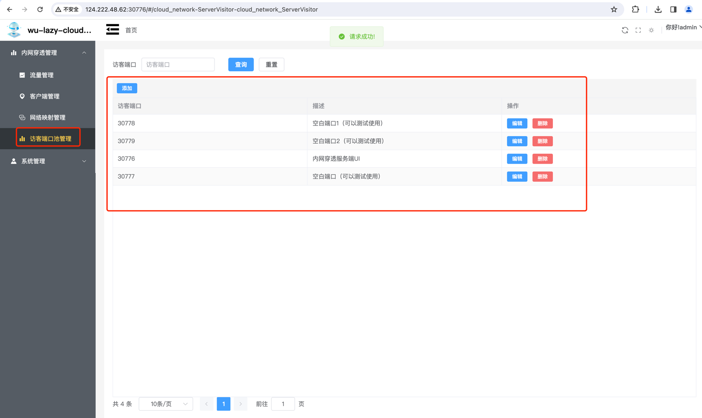
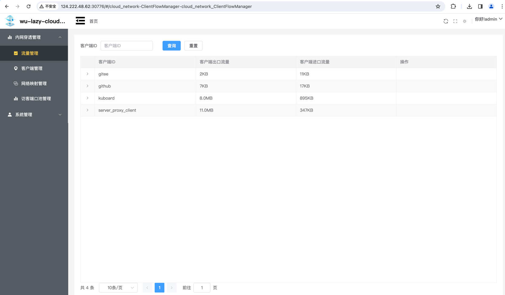

<p align="center">
    <a target="_blank" href="https://search.maven.org/search?q=wu-lazy-cloud-network%20wu-lazy-cloud-network">
        
    </a>
    <a target="_blank" href="https://search.maven.org/search?q=wu-lazy-cloud-network%20wu-lazy-cloud-network">
        
    </a>
    <a target="_blank" href="https://www.apache.org/licenses/LICENSE-2.0.txt">
		
	</a>
    <a target="_blank" href="https://www.oracle.com/java/technologies/javase/jdk11-archive-downloads.html">
		
	</a>
    <a target="_blank" href="https://www.oracle.com/java/technologies/javase/jdk17-archive-downloads.html">
		
	</a>
    <br />
        
    <br />
    <a target="_blank" href='https://gitee.com/wujiawei1207537021/wu-lazy-cloud-network'>
		
	</a>

</p>

#### 项目介绍
[wu-lazy-cloud-network](https://gitee.com/wujiawei1207537021/wu-lazy-cloud-network) 是一款基于（[wu-framework-parent](https://gitee.com/wujiawei1207537021/wu-framework-parent)）孵化出的项目，内部使用Lazy ORM操作数据库，主要功能是网络穿透，对于没有公网IP的服务进行公网IP映射
使用环境JDK17 Spring Boot 3.0.2

#### 架构图


#### 实现原理
##### 服务端创建socket服务端绑定本地端口（用于客户端连接）
```java
package wu.framework.lazy.cloud.heartbeat.server.netty.socket;


import io.netty.bootstrap.ServerBootstrap;
import io.netty.channel.ChannelFuture;
import io.netty.channel.ChannelFutureListener;
import io.netty.channel.ChannelOption;
import io.netty.channel.EventLoopGroup;
import io.netty.channel.nio.NioEventLoopGroup;
import io.netty.channel.socket.nio.NioServerSocketChannel;
import wu.framework.lazy.cloud.heartbeat.server.netty.filter.NettyServerFilter;

public class NettyOnCloudNettyServerSocket {
    private final EventLoopGroup bossGroup = new NioEventLoopGroup();
    private final EventLoopGroup workerGroup = new NioEventLoopGroup();
    private final NettyServerFilter nettyServerFilter;// 通道业务处理
    private ChannelFuture channelFuture;

    public NettyOnCloudNettyServerSocket(NettyServerFilter nettyServerFilter) {
        this.nettyServerFilter = nettyServerFilter;
    }

    /**
     * 启动服务端
     *
     * @throws Exception
     */
    public void startServer(int serverPort) throws Exception {
        try {

            ServerBootstrap b = new ServerBootstrap();
            b.group(bossGroup, workerGroup).channel(NioServerSocketChannel.class)
                    // 给服务端channel设置属性
                    .option(ChannelOption.SO_BACKLOG, 128)

                    .childOption(ChannelOption.SO_KEEPALIVE, true)
                    .childHandler(nettyServerFilter)
            ;
            channelFuture = b.bind(serverPort).sync();

            channelFuture.addListener((ChannelFutureListener) channelFuture -> {
                // 服务器已启动
            });
            channelFuture.channel().closeFuture().sync();
        } finally {
            shutdown();
            // 服务器已关闭
        }
    }

    public void shutdown() {
        if (channelFuture != null) {
            channelFuture.channel().close().syncUninterruptibly();
        }
        if ((bossGroup != null) && (!bossGroup.isShutdown())) {
            bossGroup.shutdownGracefully();
        }
        if ((workerGroup != null) && (!workerGroup.isShutdown())) {
            workerGroup.shutdownGracefully();
        }
    }
}
```
##### 客户端通过class NettyClientSocket 连接服务端
```java
package wu.framework.lazy.cloud.heartbeat.client.netty.socket;


import io.netty.bootstrap.Bootstrap;
import io.netty.channel.Channel;
import io.netty.channel.ChannelFuture;
import io.netty.channel.ChannelFutureListener;
import io.netty.channel.EventLoopGroup;
import io.netty.channel.nio.NioEventLoopGroup;
import io.netty.channel.socket.nio.NioSocketChannel;
import lombok.Getter;
import lombok.extern.slf4j.Slf4j;
import wu.framework.lazy.cloud.heartbeat.client.application.ClientNettyConfigApplication;
import wu.framework.lazy.cloud.heartbeat.client.netty.filter.NettyClientFilter;
import wu.framework.lazy.cloud.heartbeat.common.MessageType;
import wu.framework.lazy.cloud.heartbeat.common.NettyProxyMsg;
import wu.framework.lazy.cloud.heartbeat.common.adapter.ChannelTypeAdapter;
import wu.framework.lazy.cloud.heartbeat.common.advanced.HandleChannelTypeAdvanced;
import wu.framework.lazy.cloud.heartbeat.common.utils.ChannelAttributeKeyUtils;

import java.util.List;
import java.util.concurrent.TimeUnit;

/**
 * 客户端连接服务端
 */
@Slf4j
public class NettyClientSocket {
    private static final EventLoopGroup eventLoopGroup = new NioEventLoopGroup();
    /**
     * 服务端host
     */
    private final String inetHost;
    /**
     * 服务端端口
     */
    private final int inetPort;
    /**
     * 当前客户端id
     */
    @Getter
    private final String clientId;
    /**
     * nacos配置信息处理应用
     */
    @Getter
    private final ClientNettyConfigApplication clientNettyConfigApplication;
    private final List<HandleChannelTypeAdvanced> handleChannelTypeAdvancedList; // 处理服务端发送过来的数据类型

    public NettyClientSocket(String inetHost, int inetPort, String clientId, ClientNettyConfigApplication clientNettyConfigApplication, List<HandleChannelTypeAdvanced> handleChannelTypeAdvancedList) {
        this.inetHost = inetHost;
        this.inetPort = inetPort;
        this.clientId = clientId;
        this.clientNettyConfigApplication = clientNettyConfigApplication;
        this.handleChannelTypeAdvancedList = handleChannelTypeAdvancedList;
    }

    public void newConnect2Server() throws InterruptedException {
        newConnect2Server(inetHost, inetPort, clientId, clientNettyConfigApplication);
    }

    protected void newConnect2Server(String inetHost, int inetPort, String clientId, ClientNettyConfigApplication clientNettyConfigApplication) throws InterruptedException {
        Bootstrap bootstrap = new Bootstrap();
        bootstrap.group(eventLoopGroup)
                .channel(NioSocketChannel.class)
                .handler(new NettyClientFilter(new ChannelTypeAdapter(handleChannelTypeAdvancedList), this))
        ;

        log.info("连接服务端IP:{},连接服务端端口:{}", inetHost, inetPort);
        ChannelFuture future = bootstrap.connect(inetHost, inetPort);
        Channel channel = future.channel();

        log.info("使用的客户端ID:" + clientId);
        future.addListener((ChannelFutureListener) futureListener -> {
            if (futureListener.isSuccess()) {

                log.info("连接服务端成功");
                // 告诉服务端这条连接是client的连接
                NettyProxyMsg nettyMsg = new NettyProxyMsg();
                nettyMsg.setType(MessageType.REPORT_CLIENT_CONNECT_SUCCESS);
                nettyMsg.setClientId(clientId);
                nettyMsg.setData((clientId).getBytes());
                ChannelAttributeKeyUtils.buildClientId(channel, clientId);
                channel.writeAndFlush(nettyMsg);
                // 在线
                clientNettyConfigApplication.clientOnLine(clientId);
            } else {
                log.info("每隔2s重连....");
                // 离线
                clientNettyConfigApplication.clientOffLine(clientId);
                futureListener.channel().eventLoop().schedule(() -> {
                    try {
                        newConnect2Server(inetHost, inetPort, clientId, clientNettyConfigApplication);
                    } catch (InterruptedException e) {
                        e.printStackTrace();
                    }
                }, 2, TimeUnit.SECONDS);
            }
        });
    }

    /**
     * 关闭连接
     */

    public void shutdown() {
        if ((eventLoopGroup != null) && (!eventLoopGroup.isShutdown())) {
            eventLoopGroup.shutdownGracefully();
        }
    }

}
```
##### 通过客户端与服务端建立的连接进行访客端口绑定
    上述连接会形成一个channel，我们称之为通道（本文中简单叫**心跳通道**）
    第一步 页面GUI进行新增访客端口而后将访客端口与客户端绑定（如果客户端已经启动，使用页面客户端下线触发第二步）
    第二步 客户端与访客端口绑定后使用**心跳通道** 发送客户端告诉客户端，你帮我绑定你本地真实端口
    第三步 访客访问，访客通过访客端口访问数据，此时访客通道打开截取访客发送的数据，然后将数据发送给客户真实通道，数据返回后再返回给访客通道

### 功能
    1.内网穿透
    2.服务端自主下发数据到客户端
    3.流量监控


### 项目结构

| 模块                                                                                                           | 版本                   | 描述                           |
|--------------------------------------------------------------------------------------------------------------|----------------------|------------------------------| 
| [wu-lazy-cloud-heartbeat-common](wu-lazy-cloud-heartbeat-common)                                             | 1.2.2-JDK17-SNAPSHOT | 内网穿透公共模块（声明接口、枚举、常量、适配器、解析器） |
| [wu-lazy-cloud-heartbeat-client](wu-lazy-cloud-heartbeat-client)                                             | 1.2.2-JDK17-SNAPSHOT | 客户端（支持二次开发）                  |
| [wu-lazy-cloud-heartbeat-server](wu-lazy-cloud-heartbeat-server)                                             | 1.2.2-JDK17-SNAPSHOT | 服务端（支持二次开发）                  |
| [wu-lazy-cloud-network-ui](wu-lazy-cloud-network-ui)                                                         | 1.2.2-JDK17-SNAPSHOT | 服务端页面                        |
| [wu-lazy-cloud-heartbeat-client-start](wu-lazy-cloud-heartbeat-sample/wu-lazy-cloud-heartbeat-client-sample) | 1.2.2-JDK17-SNAPSHOT | 客户端样例                        |
| [wu-lazy-cloud-heartbeat-server-start](wu-lazy-cloud-heartbeat-sample/wu-lazy-cloud-heartbeat-server-sample) | 1.2.2-JDK17-SNAPSHOT | 服务端样例                        |


### 使用技术

| 框架                                                                                                                                                                          | 版本                   | 描述           |
|-----------------------------------------------------------------------------------------------------------------------------------------------------------------------------|----------------------|--------------| 
| spring-boot                                                                                                                                                                 | 3.0.7                | springboot框架 |
| [wu-framework-web](https://gitee.com/wujiawei1207537021/wu-framework-parent/tree/master/wu-framework-web)                                                                   | 1.2.2-JDK17-SNAPSHOT | web容器        |
| [Lazy -ORM](https://gitee.com/wujiawei1207537021/wu-framework-parent/tree/master/wu-inner-intergration/wu-database-parent)                                                  | 1.2.2-JDK17-SNAPSHOT | ORM          |
| mysql-connector-j                                                                                                                                                           | 8.0.33               | mysql驱动      |
| [wu-authorization-server-platform-starter](https://gitee.com/wujiawei1207537021/wu-framework-parent/tree/master/wu-smart-platform/wu-authorization-server-platform-starter) | 1.2.2-JDK17-SNAPSHOT | 用户授权体系       |

### 使用环境
    IDEA
    Mac、Windows
    JAVA >=13
    MAVEN

### 启动
    docker启动
        
        docker run  -d -it -p 18080:18080 --name wu-lazy-cloud-heartbeat-server registry.cn-hangzhou.aliyuncs.com/wu-lazy/wu-lazy-cloud-heartbeat-server:1.2.2-JDK17-SNAPSHOT
        
        http://127.0.0.1:18080/swagger-ui/index.html

    源码启动
#### 页面操作

启动项目后打开服务端界面


默认账号密码：admin/admin


初始化项目

添加角色

为用户授权


刷新页面


客户端管理（客户端会自动注册）


网络映射管理（修改后者新增需要映射的客户端）


访客端口池管理（服务器端需要开放的端口）


流量管理（每个客户端使用的流量）
